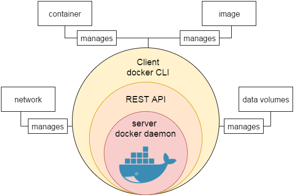

[toc]

# win

## com

**用命令的形式修改win ip？**

```
Win.更改适配器(as admin)
netsh interface ipv4 show config
netsh interface ipv4 set address name="以太网" static 192.168.2.79 255.255.255.0 192.168.1.1
netsh interface ipv4 set address name="以太网" source=dhcp //设置成以DHCP自动获取的方式
netsh interface ipv4 set address name="VMware Network Adapter VMnet1" static 192.168.1.87 255.255.255.0 192.168.1.1

way.1 一次性执行
netsh interface ipv4 set address "本地连接* 10" static 192.168.0.71 255.255.0.0 192.168.26.1

way.2 以下语句写入 *.bat中批量执行
netsh interface IP add address "本地连接* 10" 192.168.56.194 255.255.255.0
netsh interface IP set address "本地连接* 10" gateway=192.168.56.1 gwmetric=1
netsh interface IP set dns "本地连接* 10" static 8.8.8.8
netsh interface ip add dns "本地连接* 10" 61.139.2.69 index=2
pause
```

**win中检查文件的sha1/md5/sha256**

```
certutil -hashfile filename sha1/md5/sha256
```

**开启|关闭登陆密码？**

```
Win+R后执行netplwiz, 打开或关闭其开关即可；
Win + D 或 Win + M // 最小化所有窗口, D可来回操作，而M不能切换回来；
```

**Close windows auto update?**

Win r -> services.msc -> 找到windows update并双击，然后点击禁用即可；

**How to download documents form Baidu Document free?**

```
1 F12
2 Type in the codes in console$(".aside").remove();$("#doc #hd").remove();$(".crubms-wrap").remove();$(".user-bar").remove();$("#doc-header").remove();j$(".reader-tools-bar-wrap").remove();$(".fix-searchbar-wrap").remove();$("#bottom-doc-list-8").remove();$(".ft").remove();$("#ft").remove();$("#docBubble").remove();$("body").attr("margin","auto");
3 Ctrl P & save as pdf
```

**字号对照表?**


**win hotkey**

- 【切换相关】Alt+Tab 普通的任务切换 Win+Tab 当前视窗中任务切换 Win+方向键 对当前的窗口进行停留贴靠操作

- 【任务视图】Win+Ctrl+D 可创建一个新的虚拟桌面 Win+Ctrl+左右方向键 查看或切换虚拟桌面 Win+Ctrl+F4 关闭最近使用的虚拟桌面

- Ctrl+Shift+Esc 任务管理器

- Win+R

  - (Link. [https://support.microsoft.com/en-us/help/192806/how-to-run-control-panel-tools-by-typing-a-command](https://support.microsoft.com/en-us/help/192806/how-to-run-control-panel-tools-by-typing-a-command))

    

    | win + r    | Note             |
    | ---------- | ---------------- |
    | appwiz.cpl | 打开卸载程序     |
    | control    | 控制面板         |
    | regedit    | 打开注册表       |
    | gpedit.msc | 打开组策略编辑器 |
    |            |                  |

**Set win7.env by command way**

```
set 查看环境变量设置[in cmd]
set Path 查看具体某个环境变量的设置
set newEnv=c: 要创建一个名为newEnv的，值为“c:”的环境变量
set oldEnv= 删除某一个环境变量
set Path=%Path%;d:\Alex-softwares\cmder-my\cmder 追加环境变量的设置
```

**Record text in chrome tab**

- data:text/html, <body contenteditable style="font: 1.5rem/1.5 monospace;max-width:60rem;margin:0 auto;padding:4rem;">
- data:text/html, <html contenteditable>

**Look over CPU info and memory type？**

- cmd ->wmic -> cpu get * -> memorychip


## tools

### chrome

Chrome快捷键
```
Ctrl+PgDown 切换到下一个标签页 Ctrl+PgUp 切换到上一个标签页
Ctrl+1 ... Ctrl+8 切换到指定编号位置的标签页 Ctrl+9 切换到最后一个标签页 Ctrl+T 打开新标签页
Alt+Home 在当前窗口中打开主页
按住 Ctrl 键，然后点击链接 从后台在新标签页中打开链接，但您仍停留在当前标签页中
按住 Ctrl+Shift 键，然后点击链接 在新标签页中打开链接，同时切换到新打开的标签页
按住 Shift 键，然后点击链接，在新窗口中打开链接
Ctrl+H 查看”历史记录”页 Ctrl+J 查看”下载”页 Ctrl+W 关闭当前标签页
Shift+Escape 查看任务管理器
```

Plugin
- [https://www.crx4chrome.com/](https://www.crx4chrome.com/)
- [http://www.cnplugins.com/](http://www.cnplugins.com/)
- [http://chromecj.com/](http://chromecj.com/)

| chrome                                                       | plugin                                                       |
| ------------------------------------------------------------ | ------------------------------------------------------------ |
| [如何用好谷歌等搜索引擎？](https://www.zhihu.com/question/20161362) | Vimium                                                       |
|                                                              | Xmarks                                                       |
|                                                              | [unlocker](http://www.updatestar.com/zh-cn/directdownload/unlocker/2098357) |

### book-kindle

| Book.way                                                     | Book.Download                                |
| ------------------------------------------------------------ | -------------------------------------------- |
| [你也许并不太懂Kindle](http://www.jianshu.com/p/bbec5f21eba8) | [All IT eBooks](http://www.allitebooks.org/) |
| [1个短清单，帮你找到99%的电子书](https://www.jianshu.com/p/84c004f8c46d) | [manybooks](https://manybooks.net/)          |
|                                                              | [七彩英语](http://www.qcenglish.com/)        |


# linux

## Linux.Basic

su 和 sudo、su root和su - root 区别?


```
## su 和 sudo 的区别？
1.共同点：都是root用户的权限；
2.不同点：su仅仅取得root权限，工作环境不变，还是在切换之前用户的工作环境；

sudo 完全取得root的权限和root的工作环境
su 获取临时的root权限
(若/etc/shadow密码文件需要使用root权限才能打开与编辑，sudo gedit /etc/shadow表示临时使用root权限来编辑/etc/shadow密码文件，所以使用了sudo命令临时使用root权限来做一些普通账户无法完成的事)
su - root 和 su root（su）有什么区别？
su 之后目录还是原先用户的目录，而不是root用户的主目录；
su - root 之后目录就变为root用户的主目录；
sudo su 		//普通账户切换到root
su normal-user  //root切换到普通账户
```

basic


```
pwd -P    //显示链接的真实路径，有可能是链接路径
cd -      //切换到前一个用过的目录
cd        //cd后是空的, 切到当前用户的家目录
touch [file]      //创建或更新文件时间
du -hs .          //显示目录或文件的容量， -h 人性化呈现，-s 仅显示总容量
head -c 2K file   //显示前2K的内容
cat -[bn] file    //b 显示行号（含空白行），n 显示行号（不含空白行）
tail -f file      //实时动态显示文件内容
wc -[lwc] file    //统计文件[行数，单词数，字节数]
```


alias

```
root@2b50e1fdb3d4:~# alias //查看系统中所有的别名
alias egrep='egrep --color=auto'
alias fgrep='fgrep --color=auto'

root@2b50e1fdb3d4:~# alias lls='ls -al' //定义新的别名
root@2b50e1fdb3d4:~# alias lls //查看此别名的含义
alias lls='ls -al'

root@2b50e1fdb3d4:~# unalias lls //取消别名的定义
root@2b50e1fdb3d4:~# alias lls
-su: alias: lls: not found
```

PATH


```
ingookey@ubuntu:~$ env
# 查看环境变量资源; 设置环境变量可修改/etc/profile 或 .bashrc; 通过export ${var}以确定是否修改成功,需要重新登陆;

查看path是否含有：/usr/local/sbin？打印出来查看即可
echo $PATH
修改临时环境变量（重启后消失）?
export PATH=$PATH:/usr/local/sbin:/usr/local/bin:/sbin:/bin:/usr/sbin:/usr/bin
修改永久环境变量?
修改/etc/profile文件（所有用户）vim /etc/profile加入：export PATH=$PATH:/usr/local/sbin:/usr/local/bin:/sbin:/bin:/usr/sbin:/usr/binsource /etc/profile.修改~/.bashrc文件（单独用户）vim ~/.bashrc （每个用户目录下都有，ls -all）加入：export PATH=$PATH:/usr/local/sbin:/usr/local/bin:/sbin:/bin:/usr/sbin:/usr/binsource ~/.bashrc
```

系统属性

```
ingookey@ubuntu:~$ uname -a
# 查看内核/操作系统/CPU信息的linux系统信息
Linux ubuntu 4.4.0-17763-Microsoft #379-Microsoft Wed Mar 06 19:16:00 PST 2019 x86_64 x86_64 x86_64 GNU/Linux

ingookey@ubuntu:~$ uptime
# 查看系统运行时间、用户数、负载
00:26:34 up 18 min,  0 users,  load average: 0.52, 0.58, 0.59
```

```
ingookey@ubuntu:~$ cat /proc/cpuinfo | grep "physical id" | uniq | wc -l
​1
​ingookey@ubuntu:~$ cat /proc/cpuinfo | grep "cpu cores" | uniq
​cpu cores       : 4
​ingookey@ubuntu:~$ cat /proc/cpuinfo | grep "model name" | uniq
​model name      : Intel(R) Core(TM) i5-8250U CPU @ 1.60GHz
​# 此机器有1个4核CPU, 型号为Intel(R) Core(TM) i5-8250U CPU @ 1.60GHz
​
​ingookey@ubuntu:~$ cat /etc/issue | head -n 5
​# 查看操作系统版本
​Ubuntu 18.04.2 LTS \n \l
​
​ingookey@ubuntu:~$ cat /proc/meminfo | grep MemTotal
​MemTotal:       16634540 kB
​# 检查内存总量; 内存16G
​
​ingookey@ubuntu:~$ grep MemFree /proc/meminfo
​MemFree:         6595716 kB
​# 检查空闲内存总量; 6.5G
​
​ingookey@ubuntu:~$ df -h
​# 查看各分区使用情况
​Filesystem      Size  Used Avail Use% Mounted on
​rootfs          155G  100G   56G  65% /
​none            155G  100G   56G  65% /dev
​none            155G  100G   56G  65% /run
​none            155G  100G   56G  65% /run/lock
​none            155G  100G   56G  65% /run/shm
​none            155G  100G   56G  65% /run/user
​C:              155G  100G   56G  65% /mnt/c
​D:              323G  246G   77G  77% /mnt/d
​
​ingookey@ubuntu:~$ du -sh ./app_tool
​# 查看指定目录的大小
​4.5M    ./app_tool

​ingookey@ubuntu:~$ mount | column -t
​# 检查挂载的分区情况
​rootfs       on  /                         type  lxfs         (rw,noatime)
​none         on  /dev                      type  tmpfs        (rw,noatime,mode=755)
​sysfs        on  /sys                      type  sysfs        (rw,nosuid,nodev,noexec,noatime)
​proc         on  /proc                     type  proc         (rw,nosuid,nodev,noexec,noatime)
​devpts       on  /dev/pts                  type  devpts       (rw,nosuid,noexec,noatime,gid=5,mode=620)
​none         on  /run                      type  tmpfs        (rw,nosuid,noexec,noatime,mode=755)
​none         on  /run/lock                 type  tmpfs        (rw,nosuid,nodev,noexec,noatime)
​none         on  /run/shm                  type  tmpfs        (rw,nosuid,nodev,noatime)
​none         on  /run/user                 type  tmpfs        (rw,nosuid,nodev,noexec,noatime,mode=755)
​binfmt_misc  on  /proc/sys/fs/binfmt_misc  type  binfmt_misc  (rw,noatime)
​C:           on  /mnt/c                    type  drvfs        (rw,noatime,uid=1000,gid=1000,case=off)
​D:           on  /mnt/d                    type  drvfs        (rw,noatime,uid=1000,gid=1000,case=off)
​
​ingookey@ubuntu:~$ id syslog
​# 查看用户syslog信息, 用'id'可查当前用户信息
​uid=102(syslog) gid=106(syslog) groups=106(syslog),4(adm)
​ingookey@ubuntu:~$ cut -d: -f1 /etc/passwd   # 查看系统所有用户
​ingookey@ubuntu:~$ cut -d: -f1 /etc/group    # 查看系统所有用户组

​ingookey@ubuntu:~$ last
​# 检查用户登陆日志
​ingookey pts/1        127.0.0.1        Mon Jul 15 16:52    gone - no logout
​ingookey pts/0        127.0.0.1        Mon Jul 15 16:51    gone - no logout
​wtmp begins Mon Jul 15 16:51:20 2019
```

cpu

```
cat /proc/cpuinfo | grep "physical id" | sort | uniq //当前机器拥有的物理CPU个数
cat /proc/cpuinfo | grep "cores" | uniq  //单个CPU的逻辑核心数量
cat /proc/cpuinfo | grep "processor" | wc -l //当前机器拥有的CPU线程数量
```

gpu

```
ingookey@ubuntu:$ nvidia-smi
Fri Aug 23 19:34:05 2019
+-----------------------------------------------------------------------------+
| NVIDIA-SMI 390.59 Driver Version: 390.59 |
|-------------------------------+----------------------+----------------------+
| GPU Name Persistence-M| Bus-Id Disp.A | Volatile Uncorr. ECC |
| Fan Temp Perf Pwr:Usage/Cap| Memory-Usage | GPU-Util Compute M. |
|===============================+======================+======================|
| 0 Tesla P4 On | 00000000:1A:00.0 Off | 0 |
| N/A 25C P8 7W / 75W | 0MiB / 7611MiB | 0% Default |
# Fan：             风扇转速（0%--100%），N/A表示没有风扇
# Temp：            GPU温度（GPU温度过高会导致GPU频率下降
# Perf：            性能状态，从P0（最大性能）到P12（最小性能）
# Pwr：             GPU功耗
# Persistence-M：   持续模式的状态（持续模式耗能大，但在新的GPU应用启动时花费时间更少）
# Bus-Id：          GPU总线，domain:bus:device.functio
# Disp.A：          Display Active，表示GPU的显示是否初始化
# Memory-Usage：    显存使用率
# Volatile GPU-Util：GPU使用率
# ECC：          是否开启错误检查和纠正技术，0/DISABLED, 1/ENABLED
# Compute M.：   计算模式，0/DEFAULT,1/EXCLUSIVE_PROCESS,2/PROHIBITED
+-------------------------------+----------------------+----------------------+
| 1 Tesla P4 On | 00000000:1B:00.0 Off | 0 |
| N/A 30C P8 6W / 75W | 0MiB / 7611MiB | 0% Default |
# 显存占用和GPU占用是两个不一样的东西，显卡是由GPU和显存等组成的，显存和GPU的关系有点类似于内存和CPU的关系。我跑caffe代码的时候显存占得少，GPU占得多，师弟跑TensorFlow代码的时候，显存占得多，GPU占得少。
# nvidia-smi -l   //回环刷新状态，ctrl+c终止
# nvidia-smi -L   //打印GPU列表和ID信息
+-------------------------------+----------------------+----------------------+
| 2 Tesla P4 On | 00000000:1D:00.0 Off | 0 |
| N/A 29C P8 6W / 75W | 0MiB / 7611MiB | 0% Default |
+-------------------------------+----------------------+----------------------+
| 3 Tesla P4 On | 00000000:1E:00.0 Off | 0 |
| N/A 28C P8 6W / 75W | 0MiB / 7611MiB | 0% Default |
+-------------------------------+----------------------+----------------------+
| 4 Tesla P4 On | 00000000:3D:00.0 Off | 0 |
| N/A 25C P8 6W / 75W | 0MiB / 7611MiB | 0% Default |
+-------------------------------+----------------------+----------------------+
| 5 Tesla P4 On | 00000000:3E:00.0 Off | 0 |
| N/A 25C P8 6W / 75W | 0MiB / 7611MiB | 0% Default |
+-------------------------------+----------------------+----------------------+
| 6 Tesla P4 On | 00000000:41:00.0 Off | 0 |
| N/A 27C P8 6W / 75W | 0MiB / 7611MiB | 0% Default |
+-------------------------------+----------------------+----------------------+
| 7 Tesla P4 On | 00000000:42:00.0 Off | 0 |
| N/A 24C P8 6W / 75W | 0MiB / 7611MiB | 0% Default |
+-------------------------------+----------------------+----------------------+
+-----------------------------------------------------------------------------+
| Processes: GPU Memory |
| GPU PID Type Process name Usage |
|=============================================================================|
| No running processes found |
+-----------------------------------------------------------------------------+
# lspci | grep NVIDIA                   //查看pci-e通道上是否有正确数量的gpu
# nvidia-smi -q | grep "Serial Number"  //查看当前正常的GPU序列号，再拆机查看不在其中即为异常状态

#1. nvidia-smi -q #查询所有GPU的当前详细信息
#2. 手动设置GPU卡设备的状态选项
#3. nvidia-smi dmon	#设备监控命令，以滚动条形式显示GPU设备统计信息
#4. nvidia-smi pmon	#进程监控命令，以滚动条形式显示GPU进程状态信息
[REF] https://blog.csdn.net/handsome_bear/article/details/80903477
```

磁盘

```
ingookey@ubuntu:~$ sudo megaclisas-status
[sudo] password for ingookey: 
-- Controller information --
-- ID | H/W Model                   | RAM    | Temp | BBU    | Firmware     
c0    | AVAGO MegaRAID SAS 9361-16i | 2048MB | 49C  | Good   | FW: 24.22.0-0023 

-- Array information --
-- ID | Type   |    Size |  Strpsz | Flags | DskCache |   Status |  OS Path | CacheCade |InProgress   
c0u0  | RAID-1 |    223G |  256 KB | RA,WB |  Default |  Optimal | /dev/sda | None      |None         
c0u1  | RAID-5 |   6983G |  256 KB | RA,WB |  Default |  Optimal | /dev/sdb | None      |None         
c0u2  | RAID-5 |  14552G |  256 KB | RA,WB |  Default |  Optimal | /dev/sdc | None      |None         

-- Disk information --
-- ID  | Type | Drive Model                                     | Size     | Status          | Speed    | Temp | Slot ID  | LSI Device ID
c0u0p0 | SSD  | BTYF9135076Z240AGN INTEL SSDSC2KB240G8 XCV10110 | 223.0 Gb | Online, Spun Up | 6.0Gb/s  | 20C  | [252:0]  | 14      
c0u0p1 | SSD  | BTYF9135074C240AGN INTEL SSDSC2KB240G8 XCV10110 | 223.0 Gb | Online, Spun Up | 6.0Gb/s  | 19C  | [252:1]  | 15      
c0u1p0 | SSD  | PHYF920202AM1P9DGN INTEL SSDSC2KB019T8 XCV10110 | 1.745 TB | Online, Spun Up | 6.0Gb/s  | 21C  | [252:2]  | 13      
c0u1p1 | SSD  | PHYF920202DJ1P9DGN INTEL SSDSC2KB019T8 XCV10110 | 1.745 TB | Online, Spun Up | 6.0Gb/s  | 24C  | [252:3]  | 12      
c0u1p2 | SSD  | PHYF920101L71P9DGN INTEL SSDSC2KB019T8 XCV10110 | 1.745 TB | Online, Spun Up | 6.0Gb/s  | 23C  | [252:4]  | 17      
c0u1p3 | SSD  | PHYF920201Y01P9DGN INTEL SSDSC2KB019T8 XCV10110 | 1.745 TB | Online, Spun Up | 6.0Gb/s  | 23C  | [252:5]  | 18      
c0u1p4 | SSD  | PHYF920202BJ1P9DGN INTEL SSDSC2KB019T8 XCV10110 | 1.745 TB | Online, Spun Up | 6.0Gb/s  | 24C  | [252:6]  | 16      
c0u2p0 | HDD  | ZC19KWPHST4000NM0115-1YZ107 SN04                | 3.637 TB | Online, Spun Up | 6.0Gb/s  | 30C  | [252:7]  | 22      
c0u2p1 | HDD  | ZC19KWNGST4000NM0115-1YZ107 SN04                | 3.637 TB | Online, Spun Up | 6.0Gb/s  | 26C  | [252:8]  | 20      
c0u2p2 | HDD  | ZC19EX7XST4000NM0115-1YZ107 SN04                | 3.637 TB | Online, Spun Up | 6.0Gb/s  | 28C  | [252:9]  | 21      
c0u2p3 | HDD  | ZC19EX80ST4000NM0115-1YZ107 SN04                | 3.637 TB | Online, Spun Up | 6.0Gb/s  | 29C  | [252:10] | 19      
c0u2p4 | HDD  | ZC19KWXYST4000NM0115-1YZ107 SN04                | 3.637 TB | Online, Spun Up | 6.0Gb/s  | 30C  | [252:11] | 23
```

[https://ipcmen.com/parted](https://ipcmen.com/parted) //磁盘分区和分区大小调整示例

[https://blog.csdn.net/gyunling/article/details/52033127](https://blog.csdn.net/gyunling/article/details/52033127) //linux 下如何给系统挂载磁盘，多个磁盘挂载到同一卷组中

[https://blog.csdn.net/arenn/article/details/78866251](https://blog.csdn.net/arenn/article/details/78866251)

[https://blog.csdn.net/blue_red_1314/article/details/78772880](https://blog.csdn.net/blue_red_1314/article/details/78772880)

[https://blog.csdn.net/blue_red_1314/article/details/78783020](https://blog.csdn.net/blue_red_1314/article/details/78783020)

网络

```
ingookey@ubuntu:~$ ifconfig -a
# 查看所有网络接口的属性
eth0: flags=64<RUNNING>  mtu 1500
        inet 21.64.246.154  netmask 255.255.255.0
        inet6 fe80::64c4:4eb4:5176:8f46  prefixlen 64  scopeid 0xfd<compat,link,site,host>
        ether c8:f7:50:0f:78:c7  (Ethernet)
        RX packets 0  bytes 0 (0.0 B)
        RX errors 0  dropped 0  overruns 0  frame 0
        TX packets 0  bytes 0 (0.0 B)
        TX errors 0  dropped 0 overruns 0  carrier 0  collisions 0

eth1: flags=4163<UP,BROADCAST,RUNNING,MULTICAST>  mtu 1500
        inet 172.16.1.160  netmask 255.255.255.128  broadcast 172.16.1.255
        inet6 fe80::7ca7:9729:e41:c615  prefixlen 64  scopeid 0xfd<compat,link,site,host>
        ether 00:ff:fa:71:d3:9d  (Ethernet)
        RX packets 0  bytes 0 (0.0 B)
        RX errors 0  dropped 0  overruns 0  frame 0
        TX packets 0  bytes 0 (0.0 B)
        TX errors 0  dropped 0 overruns 0  carrier 0  collisions 0

ingookey@ubuntu:~$ ip a
12: eth0: <> mtu 1500 group default qlen 1
    link/ether c8:f7:50:0f:78:c7
    inet 21.64.246.154/24 brd 21.64.246.255 scope global dynamic
       valid_lft forever preferred_lft forever
    inet 169.254.143.70/16 brd 169.254.255.255 scope global dynamic
       valid_lft forever preferred_lft forever
    inet6 fe80::64c4:4eb4:5176:8f46/64 scope link dynamic
       valid_lft forever preferred_lft forever
24: eth1: <BROADCAST,MULTICAST,UP> mtu 1500 group default qlen 1
    link/ether 00:ff:fa:71:d3:9d
    inet 172.16.1.160/25 brd 172.16.1.255 scope global dynamic
       valid_lft forever preferred_lft forever
    inet6 fe80::7ca7:9729:e41:c615/64 scope link dynamic
       valid_lft forever preferred_lft forever

#netstat
netstat - 打印网络连接、路由表、连接的数据统计、伪装连接以及广播域成员。
.列出所有连接  netstat -a
.只列出 TCP 或 UDP 协议的连接  netstat -at //-au
```

[https://linux.cn/article-2434-1.html](https://linux.cn/article-2434-1.html)   netstat how to use? 

**时区 & 时间**

修改时区? CTS, UTC

$ mv /etc/localtime /etc/localtime.bak

$ ln -s /usr/share/zoneinfo/Asia/Shanghai /etc/localtime

$ date


其它

$ date -R //中国为东8区, tzselect 可方便地设置时区 clock 查看CMOS时间

修改时间

```
//way.1
sudo date -s "year-month-day hh:mm:ss" //修改日期 或 date -s "2016-11-06 01:59:00"
sudo date -s hh:mm:ss  //修改时间
sudo hwclock --systohc //修改时间以后，修改硬件CMOS的时间;非常重要，如果没有这一步的话，后面时间还是不准; 将当前时间和日期写入BIOS，避免重启后失效 hwclock -w

//way.2
sudo vim /etc/ntp.conf (server 35.48.80.11)
sudo service ntp restart
sudo hwclock --systohc
将“TZ='Asia/Shanghai'; export TZ” 写入.profile文件中再重新登入即可；
```

**12小时制与24小时制**

```
date +%r  //显示12小时制
date +%R  //显示24小时制
要想默认修改显示时间为24小时, 可写入vi ~/.bashrc, alias date='date "+%a %b %d %H:%M:%S %Z %Y"'
```

- nohup | lsof

  - nohup
    - 命令可以在你退出帐户/关闭终端之后继续运行相应的进程(no hang up), nohup command &,
    - .输出都将附加到当前目录的nohup.out文件中
      - nohup ls -ah
  - lsof
    - yum -y install lsof
    - .实现后台的ftp上传和下载
      - 两个常用的ftp工具ncftpget和ncftpput
    - .查看谁正在使用文件/bin/bash [lsof（listopen files）是一个列出当前系统打开文件的工具]
      - lsof /bin/bash
    - .列出某个进程所打开的文件
      - lsof -c mysql // lsof | grep 'mysql'

- at & cron

  - at

    //使用前需开启此atd servicecron是一个linux下的定时执行工具，可以在无需人工干预的情况下运行作业。　　service atd start //启动服务 service atd stop //关闭服务　　service atd restart //重启服务 service atd reload //重新载入配置　　service atd status //查看服务状态at 10:10at 4pm + 3 daysat 10:10 2018-09-15 //创建定时任务，CTRL D退出编辑任务（首先需要开启服务）-f file : 读入预先写好的命令档。使用者不一定要使用交互模式来输入命令at -l //列出当前有的一次性定时任务at -c id //查看id任务的详细信息at -d id //删除id任务

  - crone

    uptime // 查询服务器已经运行的时间，及(1,5,15min) 系统的平均负载量，负载量越低意味着你的系统性能越好free -m // display the amount of free and used system memory.df -i //磁盘 inode使用量的信息，最多可创建的文件个数，若inode资源用完了，即使有剩余空间也不能再创建文件;top -d 2 // 每隔2秒动态查看进程top -d 2 -p 85 // 每隔2秒动态查看pid为85的进程

    

    

    

    

- ppa

  - link.how to use? [http://linux.it.net.cn/Ubuntu/2014/1112/8243.html](http://linux.it.net.cn/Ubuntu/2014/1112/8243.html)
  - link.ppa [https://launchpad.net/ubuntu/+ppas](https://launchpad.net/ubuntu/+ppas)

- kill process in linux

  1. ps aux | grep firefox, kill pid

  2. killall firefox

  3. (application)system monitor

  4. Ctrl + Alt + Esc激活快捷方式

## Linux.Tool

### compare code

[https://www.maketecheasier.com/file-comparison-tools-for-linux/](https://www.maketecheasier.com/file-comparison-tools-for-linux/)

### which & whereis & locate & find

which 查看可执行文件和别名(alias)的位置

whereis 查看文件的位置,可以找到可执行命令和man page

locate 在索引数据库里查找，数据库可能每周更新一次；

find 实际搜寻硬盘查询文件名称 (find也可以根据文件大小-size 时间-atime 正则表达式-regex)

- which

  which 可执行文件名称

  主要用来查找系统PATH环境变量目录下的可执行文件, 就是查找那些我们已经安装好的可以直接执行的命令。

  which geany //现在运行的程序来自哪里？

- whereis

  主要用来查找二进制（命令）、源文件、man文件。与which不同的是这条命令可以是通过文件索引数据库而非PATH来查找的，所以查找的面比which要广；

  whereis [-bmsu] 文件或者目录名称

  参数说明：

  -b ： 只找二进制文件

  -m： 只找在说明文件manual路径下的文件

  -s ： 只找source源文件

  -u ： 没有说明文档的文件

  whereis geany (将和geany文件相关的文件都查找出来)

  whereis -b geany (只将二进制文件查找出来)

- locate

  主要通过数据库查找文件，但是这个命令的适用范围就比whereis大多了。这个命令可以找到任意指定的文件，并且可以只输入部分文件名。同时locate还可以通过-r选项使用正则表达式，功能十分强大。

  locate其实由以下四部分组成：

  /usr/bin/updatedb 主要用来更新数据库；

  /usr/bin/locate(mlocate) 用来完成查询功能的程序；

  /etc/updatedb.conff 是配置要查询哪些目录、哪些文件；

  /var/lib/mlocate/mlocate.db 存放文件信息的文件；

  locate geany | head -n 2

  //查找和geany相关的所有文件

  locate -i -r sql$ -n 5

  //查找以sql结尾的文件，前5个(-i 不区分大小写，默认区分大小写)

  locate -r ^/sql/usr

  //查找以/sql/usr开头的文件

- find

  ```
  .查找2*24小时内修改过的文件[a,c,m][min,time] n[访问，改变文件状态，改变文件数据][分钟，小时]
  n表示文件更改时间距现在n天以内，+n表示文件更改时间距现在n天以前
  find . -atime -2
  
  .查找当前目录下权限为777的文件
  find . -perm 777
  
  .查找当前所有目录并排序(-type [d|f])
  find . -type d | sort
  
  .查找当前目录大于1K的文件[c byte]
  find . -size +1000c -print
  
  总结 which & whereis & locate & find
  	当使用whereis和locate时，会从数据库中查找数据，效率自然会很高（而不是像find命令那样，通过遍历硬盘来查找，因此非常消耗硬盘的资源，而且效率也非常c低）。但该数据库文件并不是实时更新，默认情况下时一星期更新一次，因此用whereis和locate查找文件时，可能会找到已经被删除的文件，或者刚刚建立文件却无法查找到，原因就因为数据库文件还没有被更新，这时可以使用updatedb命令更新索引数据库。
  ```

- sed

  ```
  #grep 、sed 和awk并称为文本三剑客
  
  使用Grep就可以很好的实现文本查找的功能，而且简单有效。然而其却无法直接对其进行编辑，sed的出现便解决了这一问题。
  Sed被称为流编辑器，它是一种新型的非交互式的文本编辑器，它逐行处理文件或输入，并将结果输出到屏幕上。
  Sed编辑没有破坏性，它默认不会修改文件，除非使用选项主动修改。如果需要进行多项编辑任务，也可以把命令写在一个叫sed脚本的文件里。
  sed是如何处理文本？
  sed流处理编辑器，行处理，一次处理一行，不改变源文件的内容
  正则选定文本 -> sed进行处理
  .命令行格式
  sed [options] 'command' file(s)
  options: -n 取消默认输出，-e允许多项编辑，-f FILE 从指定文件FILE中读取编辑脚本，-r 支持使用扩展正则表达式
  command: 行定位(正则) + sed命令操作
  
  .脚本格式
  sed -f scriptfile(s)
  ## sed的基本操作命令
  sed 'p' debug //打印两次
  sed -n 'p' debug //打印一次(-n取消默认输出, 不然会打印两次)
  
  .定位行号
  sed -n '10p' debug
  //打印第10行，nl debug | sed -n '10p' 查看确认(nl 之后可显示行号，空白行无行号)
  sed -n '/spool/p' debug //通过正则定位行号
  sed -n '10, 20p' debug //显示第10行到第20行间的内容
  sed -n '/mail/, 20p' debug //从第一个匹配项开始
  
  .行号取反操作
  sed -n '10!p' debug
  sed -n '10, 20!p' debug //第10行及第20行也被排除
  
  .间隔行
  nl debug | sed -n '1~2p' //first~step（nl -b a -n rz -w 3 debug 可更好的呈现）
  a 新增行，i 插入行，c 替代行，d 删除行
  sed '1a====='
  sed '1, 5a=====' //在1,5后都增加行，也可单行操作
  sed '1, 5i=====' //在1,5前都插入行
  sed '1, 5c=====' //在1,5都替换成，整体替换
  sed '1, 5d' //删除操作
  eg.
  sed '$a\\tport: 553\n\tpermission on'
  sed '/^$/d' //删除空行
  sed -n '/Error/p' debug //打印error相关信息
  
  .替换命令
  nl debug | sed 's/false/true/' //用true替换false，只替换每一行的第一个
  nl debug | sed 's/false/true/g' //全局替换
  ifconfig ens33 //本机IP信息
  ifconfig ens33 | sed -n '/inet /p' | sed -n 's/inet //p' | sed -n 's/net.*$//p' //对IP地址的处理
  
  ## sed的高级操作命令
  n //读取下一行
  nl debug | sed -n '{n;p}' //仅显示偶数行部分
  nl debug | sed -n '2~2p' //因为从第1行计数，在sed中
  nl debug | sed -n '{p;n}' //仅显示奇数行部分
  nl debug | sed -n '1~2p'
  & //替换固定的字符串
  nl debug | sed -n '{s/login/&xxx/p}' //这里&代表login，代表要替换的部分
  sed -n 's/^[a-z_-]\+/& /p' debug
  \u\l\U\L // \u\l 首字母大小写的转换 \U\L对全部的大小写的转换
  sed -n 's/^[a-z_-]\+/\u&/p' debug //将用户名首字母转换为大写
  ls *.txt | sed 's/^\w\+/\U&/' //将folder下文件名转为大写
  ()符号使用
  sed 's/\(^[a-z0-9_-]\+\):x:\([0-9]\+\):\([0-9]\+\):.*$/\1 \2 \3/' debug
  ifconfig ens33 | sed -n '/inet /p' | sed 's/inet \([0-9.]\+\).*$/\1/' //将IP拿出来
  r //复制指定的文件插入到匹配行
  w //复现匹配行拷贝到指定文件里
  echo -e '123\n456\n789' > file
  echo -e 'abc\ndef\nehi' > file
  sed '1r 123.txt' file //不转变文件内容，写进file
  sed '1w abc.txt' file //file的内容将没有了，写入file
  q //退出sed
  nl debug | sed '/false/q' //第一个false后退出
  nl debug | sed '10q' //第10行后退出
  # nl
  nl 可将输出的文件内容自动的加上行号，其默认的结果与cat -n类似，但 nl 可以将行号做比较多的显示设计，包括位数与是否自动补齐等功能。
  命令参数：
  -b ：指定行号指定的方式，主要有两种：
  -b a ：表示不论是否为空行，也同样列出行号(类似 cat -n)；
  -b t ：如果有空行，空的那一行不要列出行号(默认值)；
  -n ：列出行号表示的方法，主要有三种：
  -n ln ：行号在萤幕的最左方显示；
  -n rn ：行号在自己栏位的最右方显示，且不加 0 ；
  -n rz ：行号在自己栏位的最右方显示，且加 0 ；
  -w ：行号栏位的占用的位数；
  -p ：在逻辑定界符处不重新开始计算
  ```

- awk

      awk的特点
      可编程，所以处理灵活
      awk行处理方式与格式
      一次处理一行内容，切片处理 awk '{print $1}' 输出首个单词
      
      .格式
      命令行格式
      awk [options] 'command' file(s)
      基本格式
      awk [options] 'command' file(s)
      command：pattern {awk 操作命令}
      
      扩展格式
      脚本格式 awk -f scriptfiles
      awk内嵌参数应用
      $0 //表示整个当前行
      $1, $2 //表示第1个字段，第2个字段...
      分割符 awk -F ':' 'print $3' debug //若不指定，默认为空格
      ifconfig ens33 | awk -F ' ' '{print $2}' //这里可不指定 '{print $2, $3}' '{print $2 " " $3}' '{print $2 " \t" $3}'
      NR //每行的行号
      NF //每行字段的总数
      FILENAME //正在处理的文件名
      awk -F ':' '{print NR, NF, FILENAME}' debug
      awk -F ':' '{printf("Line: %3s Col: %s User:%s\n", NR, NF, $1)}' debug
      sed '/Error/p' | awk '{print $1}'
      awk '/Error/{print $1}'
      ~， !~
      ==, !=, >, <
      awk -F ':' '$1~/^m.*/{print $1}' debug //$1匹配m开头
      awk -F ':' '$3>100{print $1, $3}' debug
      
      .扩展格式
      BEGIN{print "start"} pattern{commands} END{print "end"}
      awk -F ':' 'BEGIN{print "Lines\tCol\tUser"} {print NR, NF, $1} END{print "----"FILENAME"----"}' debug
      //列表统计
      awk -F ':' 'BEGIN{count=0} $1!~/^$/{count+=1} END{print "count is: "count}' debug
      //统计用户名的个数
      awk -F ':' 'BEGIN{count=0} {if($3>100) userName[count++]=$1} END{for(i=0;i<count;i++) print i,userName[i]}' debug
      //UID>100用户名
      netstat -anp | awk '$6~/LISTEN|CONNECTED/{sum[$6]++} END{for (i in sum) print i, sum[i]}'
      //统计一定的数量

- xargs & grep

  xargs

  ```
  find -exec:
  选项会为处理每一个匹配到的文件而发起一个相应的进程；在有些情况下就会出现进程过多，系统性能下降的问题，因而效率不高等问题；
  xargs:
  xargs命令每次只获取一部分文件而不是全部，而且只有一个进程；
  xargs -a test.file echo
  //-a file 从文件中读入作为stdin
  xargs -a test.file -E "eee"
  //-E “eee” 当xargs分析到含有flag这个标志的时候就停止
  xargs -a test.file -n 2
  // -n 2 在执行的时候一次用的2个数，默认是用所有的
  ls *.file | xargs -t -i mv {} {}.bak
  //将找到的文件名都追加.bak(-t表示先打印命令，然后再执行)
  find . -name "*.sh" | xargs -I [] cp [] temp/
  // -I参数可指定其他代替字符，如例子中的[] 默认是{}
  // {} 则是默认的前边的输出；将找到文件复制到temp子目录中
  find ./folder/ -type f -print | xargs file
  //查找目录下所有普通文件，然后使用xargs命令来测试它们属于哪类文件
  find ./folder/ -type f -print | xargs chmod a-x
  //回收目录下所有普通文件的执行权限。
  find ./folder/ -type f -print | xargs grep "hostname"
  //在目录下查找所有普通文件，并用grep命令在搜索到的文件中查找hostname这个词
  pgrep mysql | xargs kill -9
  //直接杀掉mysql的进程
  ```

  grep

  ```
  grep -v 'hostname' file  //匹配不包含'hostname'的行（-v取反匹配 -i忽略大小写 -w匹配单词）
  find dic -name *.jpg | shuf -n 3000 | xargs -i cp {} dicb  //随机从dica中取3000张图片放入dicb中
  ```

- rz & sz

      //在SSH中，Windows与Linux间通过lrzsz传输文件
      install
          yum -y install lrzsz 		    // centos or rhel
          sudo apt-get install lrzsz 	// ubuntu
      
      linux -> win?
          sz file1
          sz file1 file2
          sz dir/* 	//下载dir目录下的所有文件，不包含dir里的文件夹
      win -> linux
          1. rz  //show dialog for choose file
          2. drag file to xshell.
      
      summary:
          1.lszrz非常方便，但无法传输大于4G 的文件。这时可使用Filezilla， SecureFX等FTP工具来替代；
          2.（设置默认路径）File -> Properties -> ZMODEM

  

  

### tmux & screen

#### tmux

```
sudo apt-get install tmux
1. 上下分屏：ctrl + b "		  左右分屏：ctrl + b % 	切换屏幕：ctrl + b o
2. 关闭一个终端：ctrl + b x	上下分屏与左右分屏切换： ctrl + b space
```

#### screen

        # screen config file
        # ------------------------------------------------------------------------------
        
        # ------------------------------------------------------------------------------
        # common settings
        # ------------------------------------------------------------------------------
        # set startup message, default value is on
        startup_message off
        
        # 关闭闪屏
        vbell off
        # huge scrollback buffer
        defscrollback 5000
        # 兼容shell 使得.bashrc .profile /etc/profile等里面的别名等设置生效
        #shell -$SHELL
        # 256 colors
        attrcolor b ".I"
        termcap xterm 'Co#256:AB=\E[48;5;%dm:AF=\E[38;5;%dm'
        defbce on
        # mouse tracking allows to switch region focus by clicking
        mousetrack on
        
        # 编码转换部分，UTF-8编码会被转换成GBK
        encoding UTF-8 GBK
        #断线的时候自动detach
        autodetach on
        # If a screen dies, don't freeze the whole screen waiting for it.
        nonblock on
        
        # apps I want to auto-launch
        #screen -t irssi irssi
        #screen -t mutt mutt
        
        # statusline, customized(should be one-line).
        # hardstatus alwayslastline '%{gk}[ %{G}%H %{g}][%= %{wk}%?%-Lw%?%{=b kR}[%{W}%n%f %t%?(%u)%?%{=b kR}]%{= kw}%?%+Lw%?%?%= %{g}][%{Y}%l%{g}]%{=b C}[ %D %m/%d %C%a ]%{W}'
        # the following two lines give a two-line status, with the current window highlighted
        hardstatus alwayslastline '%{= kG}[%{G}%H%? %1`%?%{g}][%= %{= kw}%-w%{+b yk} %n*%t%?(%u)%? %{-}%+w %=%{g}][%{B}%m/%d %{W}%C%A%{g}]'
        ```
        readme
        
        ```


        # how to use?
        # ------------------------------------------------------------------------------
        # 配置文件：
        #     ~/.screenrc
        
        # 启动会话：
        #     screen -S name
        
        # 启动会话，同时打开指定程序：
        #     screen python
        #     screen vi foo.c
        
        # 会话操作：
        #     screen -r    -- 恢复会话
        #     screen -x    -- 共享会话
        #     screen -ls   -- 列出会话
        #     screen -d    -- 分离会话
        #     screen -dRR  -- 强制分离
        #     screen -S ${NAME} -X screen ${CMD}    --发送命令至会话窗口
        
        # 窗口操作：
        #     操作键（C-a）
        #     C-a c        -- 创建窗口
        #     C-a w        -- 查看窗口
        #     C-a d        -- 分离会话
        #     C-a A        -- 窗口命名
        #     C-a [0-9]    -- 切换至指定窗口
        #     C-a C-a      -- 切换至上次窗口
        #     C-a n        -- 后一个窗口
        #     C-a p        -- 前一个窗口
        #     C-a <ESC>    -- /粘贴模式
        #     C-a _        -- 监视窗口（无活动时弹出提示）
        #     C-a M        -- 监视窗口（有活动时弹出提示）
        #     C-a S        -- 横向切割窗口
        #     C-a         -- 竖向切割窗口
        #     C-a tab      -- 删除区域
        #     C-a x        -- 锁定会话
        #     C-a [        -- 、滚动模式
        #     C-a ]        -- 粘贴缓冲
        #     C-a ?        -- 列出操作
        #     C-a :        -- 输入命令
        ```
        - ref
        
            [http://www.gnu.org/software/screen/manual/screen.html](http://www.gnu.org/software/screen/manual/screen.html)
    
            [http://www.softpanorama.org/Utilities/Screen/screenrc_examples.shtml](http://www.softpanorama.org/Utilities/Screen/screenrc_examples.shtml)
    
            [http://www.ibm.com/developerworks/cn/linux/l-cn-screen/](http://www.ibm.com/developerworks/cn/linux/l-cn-screen/)
    
            [http://bg.artuion.com/linux/325.html](http://bg.artuion.com/linux/325.html)
    
            [http://www.linuxidc.com/Linux/2016-01/127510.htm](http://www.linuxidc.com/Linux/2016-01/127510.htm)
    
            [https://www.91yun.org/archives/873](https://www.91yun.org/archives/873)

### vim

```
set list/set nolist  是否显示换行符
vi统计某个匹配出现的次数 :%s/hello world/&/gn
若统计从50行到100行，出现的次数，则使用 :50,100s/hello world//gn

全部删除：ggdG       全部复制：ggyG
全选高亮显示：ggvG/ggVG
复制到粘贴板: 全选高亮显示之后，ctrl+shift+c

## 粘贴相关
u 与 Ctrl + r //撤销与重做
“+y //在vim中选中内容拷贝到+号剪贴板，即系统剪贴板
“+p //把系统剪贴板的内容粘贴到vim
“0p //把已经被挤到0剪贴板的内容重新粘贴出来
:wq //保存并退出即可
vimdiff c1 c2 对比文件的不同
dd 删除一行后，还在命令模式 cc 删除一行后进入插入模式（S）
dw dl,x 删除一个单词 字符 cw cl,s 删除一个单词 字符后进入插入模式
xp 交换它及其后的字符 ddp 交换它及其后的行
自带的关键词匹配[先输入一部分，按CTRL N(反复按可移动)，对应了就ENTER]
i a 在当前字符前，后插入
I A 在当前行首，行尾插入
o O 在当前行前，后插入新行
y 复制（用于选择文本后，按y复制）
yw 复制单词（含空格） ye 复制单词（不含空格） 2yw 复制2个单词 caw 更换单词
yy 拷贝当前行（Y） 5p 粘贴内容
x 剪切当前字符，还在命令模式 s 剪切当前字符，进行插入模式
D：剪切从光标位置到行尾到剪贴板 C：和D类似，进入插入模式
```


**如何列编辑？**

```
1.命令模式，将光标放在第一行中要编辑的那个字母上；
2.CTRL v
3.5j  代表编辑以下的5行
4.SHIFT i 光标又回到刚开始的地方
5.ESC退出
```
**大小写转换**

```
~   将光标下的字母改变大小写
3~  将光标位置开始的3个字母改变其大小写
g~~ 改变当前行字母的大小写
gUU 将当前行的字母改成大写
guu 将当前行的字母全改成小写
gUw 将光标下的单词改成大写
guw 将光标下的单词改成小写gggUG 整篇文章转化为大写(转换为小写 ggguG)
（gg=光标到文件第一个字符，gU=把选定范围全部大写，G=到文件结束）gU0 从光标到行首，都变为大写
gU$  从光标到行尾，都变为大写
gUG  从光标到文章最后一个字符，都变为大写
gU1G 从光标到文章第一个字符，都变为大写
```
### ansible & sshpass

**ansible**

```
1. /etc/ansible/hosts 维护着ansible中服务器的列表，修改它并取一个名字，eg:
[myservers]
192.168.1.9
192.168.1.10

2. ansible -m ping 'myservers'
// 使用ping检查‘myservers’或者ansible节点的连通性

3. ansible -m command -a "uname -r" 'myservers'
// 检查节点的内核版本

4. ansible -m command -a "df -Th" 'myservers' > /tmp/command-output.txt
// 重定向输出到文件中

5. ansible all -m shell -a 'hostname' -i ./ansible_host
// 通过 -i 可指定ansible_host的具体位置
// 设置环境变量export ANSIBLE_HOSTS=./ansible_hostecho
```

如何在远程主机上都执行特定的脚本？

```
ansible myservers -m copy   -a "src=/opt/app/bin/targit.sh dest=~/"
ansible myservers -m script -a "~/target.sh"
```

| link                                                        | note          |
| ----------------------------------------------------------- | ------------- |
| [Ansible中文权威指南](http://www.ansible.com.cn/index.html) |               |
| [link](https://www.linuxidc.com/Linux/2015-10/123801.htm)   | ansible的示例 |
|                                                             |               |

**playbooks**


| link                                                         | note                |
| ------------------------------------------------------------ | ------------------- |
| [playbooks](https://docs.ansible.com/ansible/playbooks.html) | playbooks的官方文档 |
|                                                              |                     |
|                                                              |                     |


**sshpass**

```
sudo apt-get install sshpass
export SSHPASS='ip_passwd'
sshpass -e ssh user@ip 'df -h'
```


### git & github & ssh-key

[https://www.jianshu.com/p/038ccb3518f2](https://www.jianshu.com/p/038ccb3518f2) // git

gitlab

git 配置初始化本地库

> git config --global user.name "Administrator"//姓名，commit代码的时候用到git config --global user.email "mail address"　　//邮箱，commit代码的时候用到

代码下载修改提交代码及request?

> git clone git@gitlab.cihon.cn:misc/misc.git
>
> git checkout -b self_branch master
>
> git add somefiles //将修改的文件添加到暂存区
>
> git commit -m “commit”
>
> git push origin self_branch //push 自己的分支到gitlab

git 项目创建和master仓库初始化?

> cd existing_foldergit init //始化本地仓库git remote add origin giturl　 //本地添加远程git add .　 //将本目录下所有文件加到索引区git commit　 //将索引区数据加到历史区git push -u origin master　 //上传master分支

**Other**

mtk_repo start temp 新建temp分支
git log
git log –oneline 查看服务上的log
git branch 查看所有分支
git log alex-branch –oneline 查看一个分支的情况
git log alex-branch 查看这个分支的提交情况

git branch -D temp //删除temp这个分支
git checkout alex-branch

mtk_repo --trace upload //upload
git rebase temp

git config -l //查看配置情况
vim .git/config //查看git的配置情况
clear //清屏

github

submit codes to github?

> git clone repouse git clone https://github.com/%REPOSITORYFOLDER%/%REPOSITORYNAME%.git instead of git clone git@github.com:%REPOSITORYFOLDER%/%REPOSITORYNAME%.gitgit add filesgit status // check uploading filesgit commit -m "commit"git push origin master

ssh-key

Add ssh-key on windows?

> 1. ssh-keygen -t rsa -C "hesq2@jpush.cn" -b 4096/c/Users/Alex.he/.ssh/id_rsa2. cat /c/Users/Alex.he/.ssh/id_rsa.pub | clip3. paste in web.

**git视频教程笔记**

```
21. 如何让暂存区恢复成和HEAD(工作区)的一样？git reset HEAD, git status, git diff --cached
22. 让工作区的文件恢复为和暂存区一样？git checkout -- file
24. 消除最近的几次提交（最近的变动都不要了，暂存区与工作区都变到之前的样子） git reset --hard commit_id_old
25. 看看不同提交的指定文件的差异 git diff br_temp[com_temp] br_master[com_master]; git diff br_temp br_master -- index.file
26. 正确删除文件的方法? git rm index.file
27. 开发中临时加塞了紧急任务怎么处理？git stash; git stash list; git stash apply //将暂存区的更改放回到工作区，同时堆栈里的内容还在；若有异常可reset --hard HEAD, git stash; git stash list; git stash pop  //将暂存区的更改放回到工作区，但是堆栈里的内容已不在；
28. 如何指定不需要git管理的文件？添加文件 .gitignore
29. 如何将git仓库备份到本地？git clone --bare git位置[/哑协议，file:///智能协议] gitname.git
30. 
31. 
32. 
33. 把本地仓库同步到GitHub
34. 
35. 不同人修改了同文件的不同区域如何处理？ git fetch, git merge remote_branch[hash],git push
36. 不同人修改了同文件的同一区域如何处理？ git pull, vim conflict_file, git status, git commit, git push
37. 同时变更了文件名和文件内容如何处理？git会自动进行处理
38. 把同一文件改成了不同的文件名如何处理？在本地处理文件名，再提交
39. 禁止向集成分支执行push -f操作？危险的操作，尽量不要用
40. 禁止向集成分支执行变更历史的操作？远端集成分支不要做变基的行为，协作者看起来很不好
41. null
42. null
```


- docker

  link.

  > https://zhuanlan.zhihu.com/p/23508637 // docker学习资料整理https://www.yiibai.com/docker/ // docker易百教程

  **什么是Docker？& docker引擎**

  > 1. Docker是世界领先的软件容器平台。2. Docker使用Google公司推出的Go语言进行开发实现，基于Linux内核的cgroup，namespace，以及AUFS类的UnionFS等技术，对进程进行封装隔离，属于操作系统层面的虚拟化技术。 由于隔离的进程独立于宿主和其它的隔离的进程，因此也称其为容器。Docke最初实现是基于LXC。3. Docker能够自动执行重复性任务，例如搭建和配置开发环境，从而解放了开发人员以便他们专注在真正重要的事情上：构建杰出的软件。4. 用户可以方便地创建和使用容器，把自己的应用放入容器。容器还可以进行版本管理、复制、分享、修改，就像管理普通的代码一样。

  

  Figure 1 docker引擎组件

  Docker引擎是一个包含以下主要组件的客户端服务器应用程序。

  - docker daemon是一种服务器，它是一种称为守护进程并且长时间运行的程序。
  - REST API用于指定程序可以用来与守护进程通信的接口，并指示它做什么。
  - docker CLI一个有命令行界面(CLI)工具的客户端。

  **什么是容器？**

  一句话概括容器：容器就是将软件打包成标准化单元，以用于开发、交付和部署。容器就是Docker中用来运行应用的，Docker的容器很轻量级，但功能很强悍(容器是可读写的)。也没有镜像，镜像简单理解就是容器的只读版本，用来方便存储与交流。

  

  Figure 2 docker架构

  Docker遵循客户端 - 服务器架构，架构主要分为三个部分。

  > 1. 客户端(Client)：Docker提供命令行界面(CLI)工具，客户端与Docker守护进程交互。客户端可以构建，运行和停止应用程序。客户端还可以远程与Docker_Host进行交互。2. Docker_Host：它包含容器，映像和Docker守护程序。它提供完整的环境来执行和运行应用程序。3. 注册表(Registry)：它是全局映像库。可以访问并使用这些映像在Docker环境中运行应用程序。

  **Docker容器的特点？**

  > 1. 轻量，在一台机器上运行的多个Docker容器可以共享这台机器的操作系统内核；它们能够迅速启动，只需占用很少的计算和内存资源。镜像是通过文件系统层进行构造的，并共享一些公共文件。这样就能尽量降低磁盘用量，并能更快地下载镜像。2. 标准，Docker容器基于开放式标准，能够在所有主流Linux版本、Microsoft Windows以及包括VM、裸机服务器和云在内的任何基础设施上运行。3. 安全，Docker赋予应用的隔离性不仅限于彼此隔离，还独立于底层的基础设施。Docker默认提供最强的隔离，因此应用出现问题，也只是单个容器的问题，而不会波及到整台机器。

  **容器 & 虚拟机？**

  > 1. 容器是一个应用层抽象，用于将代码和依赖资源打包在一起。 多个容器可以在同一台机器上运行，共享操作系统内核，但各自作为独立的进程在用户空间中运行 。与虚拟机相比， 容器占用的空间较少（约几十M），瞬间就能完成启动 。2. 虚拟机（VM）是一个物理硬件层抽象，用于将一台服务器变成多台服务器。 管理程序允许多个VM在一台机器上运行。每个VM都包含一整套操作系统、一个或多个应用、必要的二进制文件和库资源，因此占用大量空间。而且VM启动也十分缓慢 。3. 通过Docker官网，我们知道了这么多Docker的优势，但是大家也没有必要完全否定虚拟机技术，因为两者有不同的使用场景。虚拟机更擅长于彻底隔离整个运行环境。例如云服务提供商通常采用虚拟机技术隔离不同的用户。而Docker通常用于隔离不同的应用 ，例如前端，后端以及数据库。总之：容器虚拟化的是操作系统而不是硬件，容器之间是共享同一套操作系统资源的。虚拟机技术是虚拟出一套硬件后，在其上运行一个完整操作系统。因此容器的隔离级别会稍低一些。

  

  Figure 3 docker的真实应用场景

  为什么要使用Docker？

  > 1. Docker的镜像提供了除内核外完整的运行时环境，确保了应用运行环境一致性，从而不会再出现“这段代码在我机器上没问题啊”这类问题；一致的运行环境2. 可以做到秒级、甚至毫秒级的启动时间。大大的节约了开发、测试、部署的时间。更快速的启动时间3. 避免公用的服务器，资源会容易受到其他用户的影响。隔离性4. 善于处理集中爆发的服务器使用压力；弹性伸缩，快速扩展5. 可以很轻易的将在一个平台上运行的应用，迁移到另一个平台上，而不用担心运行环境的变化导致应用无法正常运行的情况。迁移方便5. 使用Docker可以通过定制应用镜像来实现持续集成、持续交付、部署。持续交付和部署

  docker basic operations

  如何获取容器？ 在哪里获取容器？

  docker pull ubuntu:14.04 [https://store.docker.com/](https://store.docker.com/) [https://hub.docker.com/](https://hub.docker.com/)

  如何查看本机中有哪些docker镜像?

  > λ docker images

  

  如何运行镜像？运行之后镜像就变成了容器；

  > λ docker run -it docker.ubuntu:v7

  

  将容器转化为镜像？

  > 1. λ docker ps// 查看已经运行过哪些容器，才能通过其ID将容器转化为镜像//docker ps -a 此机器上所有运行过的容器；docker ps 目前正在运行的容器2. 将容器转化为一个新的镜像？sudo docker commit -m "add commit" -a "saymagic" 79c761f627f3 saymagic/ubuntu-nginx:v1-m参数指定提交的说明信息； -a参数指定用户信息；79c761f627f3代表容器的id；saymagic/ubuntu-nginx:v1指定目标镜像的用户名、仓库名和 tagλ docker commit -m "add alien command" 2b50e1fdb3d4 docker.ubuntu:v7通过build dockerfile命令来构建镜像？（此时镜像在当前路径）docker build -t="saymagic/ubuntu-nginx:v2" .1. 新建一个Folder docker.ubuntu, 在其中新建一个Dockerfile，并在其中添加相关命令2. docker build -t docker.ubuntu .3. 完成后，执行 docker run -td ubuntu

  

  

  删除不需要的镜像？

  docker rmi -f image_id // -f 强制删除镜像；image_id：镜像id

  运行新的镜像？

  docker run -it saymagic/ubuntu-nginx:v1

  docker run -it docker.ubuntu:v7

  如何存储镜像到云端？

  1. 首先登陆Docker Hub

  docker login // ingookey,B

  2. 上传到服务器 [https://hub.docker.com/](https://hub.docker.com/)

  docker push saymagic/ubuntu-nginx:v1

  3. 载入本地的镜像文件

  // 在需要的时候使用docker load将本地保存的镜像再次导入docker中

  docker load --input rocketmq.tar 或 docker load <rocketmq.tar>

  4. 保存镜像到本地

  docker save -o rocketmq.tar rocketmq

  // -o：指定保存的镜像的名字；rocketmq.tar：保存到本地的镜像名称

  // rocketmq：镜像名字，可通过"docker images"查看

  Docker导入本地镜像

  有了镜像之后，可以把本地的镜像导入，使用docker import 命令；例如这里下载了一个 alibaba-rocketmq-3.2.6.tar.gz 镜像文件，使用下列命令导入：

  cat alibaba-rocketmq-3.2.6.tar.gz | docker import - rocketmq:3.2.6(镜像名自己定义)

  从宿主机拷贝文件到容器

  docker cp /opt/test/file.txt container_id:/opt/testnew/

  eg: docker cp ./Dockerfile ad6fa6c453ae:/home/

  从容器拷贝文件到宿主机

  docker cp container_id:/opt/testnew/file.txt /opt/test/

  eg: docker cp ad6fa6c453ae:/home/Dockerfile H:/

  FAQ

  **系统中部分指令不可用的原因？**

  > apt-get install net-tools # ifconfigapt-get install iputils-ping # pingapt-get install iproute2 # ip

###　编辑器

#### eclipse

Eclipse下载地址

[http://www.eclipse.org/babel/downloads.php](http://www.eclipse.org/babel/downloads.php)

Eclipse的使用技巧

[http://blog.csdn.net/maybe_windleave/article/details/8933207](http://blog.csdn.net/maybe_windleave/article/details/8933207)

Checksyle

> http://eclipse-cs.sf.net/update/特点：   有利于团队风格一致； 可形成标准风格； 可遵守Google Style；

**快捷键**

> Ctrl+Shift+L 提示所有快捷键Ctrl+Shift+/  /*  */ 形式注释 Ctrl+/  //形式的注释 Ctrl + Alt + Down      在当前行的下面复制该行 Ctrl + Alt + Up         在当前行的上面复制该行 Alt   + Shift + S                 重写方法 在写好try/catch后，若想增加finally 可将光标话在try行按Ctrl + 1   设置快捷键的位置： Window->Preference->General->Key Ctrl + D:删除当前行 sysout或syso +Alt + / :快速输出System.out.println();   Ctrl+O或者Ctrl+F3 ：快速显示当前代码的outline，进行快速查找。再次按Ctrl+O或者Ctrl+F3显示父类的方法： 在显示的方法中绿色代表public方法，黄色代表protect方法，蓝色代表包方法，红色代表类私有方法。这些默认按照代码位置排序。 Ctrl + Shift + R : 打开任何资源或文件，可通配符搜索；比如 *es？等； Ctrl + E : 可快速在打开的编辑器间切换；效果同 Ctrl + Page up 与 Ctrl + Page down；


#### vscode

**VS Code快捷键**

```
ctrl shift k: 删除当前行
ctrl shift p: 命令操作
ctrl enter/ctrl shift enter: 在当前行下面/上面添加代码
alt 上下方向键：将当前行或选中的几行代码，在编辑器里上下移动
alt shift 上下方向键：那就可以复制这几行，然后粘贴到当前行的上面或者下面
ctrl k ctrl f: 对整个文档进行格式化，这样只有这段被选中的代码才会被格式化。
单文件会搜索：ctrl f（光标在搜索栏中，enter可在结果中向下循环移动，shift enter可在结果中向上循环移动） F3(光标在文件结果上，再按F3可在结果中向下循环移动， shift F3可向上循环移动)
多文件搜索：ctrl shift f
```

setting.json [vs code配置文件]

```
{
    "editor.lineNumbers": "on",
    "editor.renderWhitespace": "all",
    "editor.renderIndentGuides": true,
    "editor.minimap.enabled": true,

    "editor.cursorBlinking":"solid",
    "editor.cursorStyle":"line",
    "editor.cursorWidth": 2,

    "editor.detectIndentation": true,
    "editor.renderLineHighlight": "all",
    "editor.insertSpaces": true,
    "editor.tabSize": 4,

    "editor.formatOnType": true,
    "editor.suggest.showVariables": true,

    "extensions.ignoreRecommendations": false,
    "files.defaultLanguage": "markdown",
    "editor.rulers": [120]
}
```

FAQ

**删除空白行**

```
^\s*(?=\r?$)\n  #删除空白行
```

## component

### k8s

```
# 查看k8s pod的cpu, memory使用率情况
[root@]:~# kubectl top pod -n pod_name
NAME                                                      CPU(cores)   MEMORY(bytes)   
app-1375507206-spider-new-v1-0-55f8cbb5cb-29wnz           0m           76Mi            
app-1375507206-spider-new-v1-0-55f8cbb5cb-2s2qj           0m           69Mi            
app-1375507206-spider-new-v1-0-55f8cbb5cb-6q9w7           0m           71Mi            
app-1375507206-spider-new-v1-0-55f8cbb5cb-7s59f           0m           74Mi
# 查看相关操作对角信息
kubectl get nodes[pods,rc,svc]
#部署创建
kubectl apply -f {filename}
#更新及删除
kubectl update/delete

kubectl -n namespace get pod -o wide       //显示namespace下的pod
kubectl -n namespace describe pod {pod-id} //描述pod详细信息，可初步定为pod失败的问题
kubectl -n namespace get pod {pod-id} -o yaml //获取pod的yaml文件
kubectl -n namespace delete pod {pod-id}      //删除Pod
kubectl -n namespace get node                 //获取node信息
kubectl -n namespace descrbe node {node-name} //描述node信息

1.获取namespace信息：
kubectl get namespace
2.查看node详细信息：
kubectl describe node
3.帮助信息
kubectl scale -h
4.查看版本
kubectl version
5.查看所有的pod
kubectl get pods --all-namespaces 查看所有pod；
kubectl get deployment --all-namespaces 查看部署的应用；
kubectl get deployment --namespace=kube-system kong -o yaml
kubectl delete deployment --namespace=kube-system kong 删除指定的应用；
kubectl get services
kubectl get pod ded98392a-9d72-442f-905-3544635521-m02mv --namespace=d7c25b925-8ba7-44c3-b95
kubectl get pod ded98392a-9d72-442f-905-3544635521-m02mv --namespace=d7c25b925-8ba7-44c3-b95（查看指定
namespace的pod详细描述信息）
6.按照yaml或json格式查看pod信息：
kubectl get pod d2616548f-ea69-4244-819-1317460255-5d6pa --namespace=df432da7a-3a36-490f-a7b -o yaml
kubectl get endpoints
kubectl get namespaces
7.应用namespace是随着项目走，项目不同，namespace就不同；
kubectl命令将deployment替换RC，不再使用RC命令；
8.查看k8s的manage的pod的镜像的版本号：
kubectl get pod --namespace=kube-system manage-2792156093-ijz4l -o yaml
9.查看指定的service：
kubectl get service kubernetes
10.查看node主机：
kubectl get node --no-headers -L zone
11.查看service应用：
kubectl get endpoints --all-namespaces
kubectl describe service d5c4e0793-5b44-4b89-a51 --namespace=d07a12d56-fe42-4b27-a18
12.查看端点endpoint:
kubectl get endpoints --all-namespaces
13.查看replicaset：
replicaset是用来管理实例数量的，可以看成是rc/deployment的一个对象。
kubectl get replicaset --all-namespaces
14.删除指定replicaset:
 kubectl delete replicaset --namespace=d4c71895a-c152-4c03-ba5 de31d32c8-9205-4b8e-b12-2472488937
15.查看节点数据：
kubectl describe/get node 10.158.99.12
16.查看节点资源：
kubectl get resourcequota --all-namespaces -o yaml
18.查看指定类型pod：
kubectl get pod --all-namespaces -o yaml | grep manage
19.查看log：
kubectl logs -f --namespace=kube-system manage-3943165616-l8ahz
20.查看node信息：
kubectl get node -a
kubectl get node --show-labels
kubectl get node --show-all
21.查看endpoints信息---->
22.容器虚ip/内部端口号---查看
kubectl get endpoints --namespace=d07a12d56-fe42-4b27-a18
```

### docker

```
# 创建容器
docker run {image-id/container-id}

# 容器状态查看 -a: 显示所有的容器，包括未运行的; -n 3:列出最近创建的3个容器
runoob@runoob:~$ docker ps
CONTAINER ID   IMAGE          COMMAND                ...  PORTS                    NAMES
09b93464c2f7   nginx:latest   "nginx -g 'daemon off" ...  80/tcp, 443/tcp          myrunoob
96f7f14e99ab   mysql:5.6      "docker-entrypoint.sh" ...  0.0.0.0:3306->3306/tcp   mymysql

# 查看镜像/导入/打包
docker images && sudo docker images | grep kong
docker load -i xx.tar
docker save {image-id} > [路径/别名]
# 进入容器查看
docker exec -it {container-id} /bin/bash
# 容器日志查看
docker logs {container-id}
#删除容器
docker rm {container-id}
#删除镜像
docker rmi {image-id}
```

# 数据库

## mysql

```
查看数据库中某个用户的权限
show grants for 'root'@'localhost';
select * from mysql.user where user='root' \G;

查看mysql数据库中的所有用户
SELECT DISTINCT CONCAT('User: ''',user,'''@''',host,''';') AS query FROM mysql.user;

修改用户权限
GRANT ALL ON . TO [userName@127.0.0.1](mailto:userName@127.0.0.1) WITH GRANT OPTION;

导入.sql文件命令
use database; source d:/test.sql;

用文本方式将数据装入数据库表中（例如D:/mysql.txt）
LOAD DATA LOCAL INFILE “D:/mysql.txt” INTO TABLE MYTABLE;

查看某个数据库中所有表的数据量
use information_schema; select table_name, table_rows from tables where TABLE_SCHEMA = 'dbName' order by table_rows desc;
```

## mongodb

| [MySQL数据库学习宝典](http://c.biancheng.net/mysql/) | mysql的网络教程 |
| ---------------------------------------------------- | --------------- |
|                                                      |                 |
|                                                      |                 |
|                                                      |                 |


# 数据结构与算法


| link                                                    | note         |
| ------------------------------------------------------- | ------------ |
| [常用算法的时间复杂度](https://www.bigocheatsheet.com/) | 上图来自这里 |
|                                                         |              |
|                                                         |              |

数组与链表

```
数组 array
因内存管理器连续存储的特性，所以lookup o(1), insert o(n), delete o(n)
为了改善数组插入与删除的时间复杂度

链表 linked list
lookup o(n), insert o(1), delete o(1)

doubly linked list
space o(n), prepend o(1), append o(1), lookup o(n), insert o(1), delete o(1)
```

| link                                                         | note |
| ------------------------------------------------------------ | ---- |
| [反转链表](https://leetcode-cn.com/problems/reverse-linked-list/) |      |
| [两两反转](https://leetcode-cn.com/problems/swap-nodes-in-pairs/) |      |
|                                                              |      |


# script

## shell

|                                                              |                                                              |
| ------------------------------------------------------------ | ------------------------------------------------------------ |
|                                                              | [bash快捷键汇总](https://linuxtoy.org/archives/bash-shortcuts.html) |
|                                                              | [易白 shell教程](https://www.yiibai.com/bash/)               |
| [Advanced Bash-Scripting Guide 外网](http://tldp.org/LDP/abs/html/) | [GNU Coreutils](https://www.gnu.org/software/coreutils/manual/html_node/index.html#SEC_Contents) |
|                                                              | [sed, a stream editor](https://www.gnu.org/software/sed/manual/sed.html#index-Copy-hold-space-into-pattern-space-168) |

**expect**

方式1

```
#!/usr/bin/expect -f

set timeout 10
# 切换到root用户, 然后执行ls和df命令:
spawn su - root
expect "Password*"
send "123456\r"
expect "]*"         # 通配符
send "ls\r"
expect "#*"         # 通配符的另一种形式
send "df -Th\r"
send "exit\r"       # 退出spawn开启的进程

expect eof          # 退出此expect交互程序
```

方式2

```
#!/bin/bash

ip="172.16.22.131"
username="root"
password="123456"

# 指定执行引擎
/usr/bin/expect <<EOF
    set time 30
    spawn ssh $username@$ip df -Th
    expect {
        "*yes/no" { send "yes\r"; exp_continue }
        "*password:" { send "$password\r" }
    }
    expect eof
EOF
```


## python

| Python教程                                                   |                                                              |
| ------------------------------------------------------------ | ------------------------------------------------------------ |
| [廖雪峰的python教程](https://www.liaoxuefeng.com/wiki/1016959663602400) | [python3-cookbook](https://python3-cookbook.readthedocs.io/zh_CN/latest/index.html) |
|                                                              | [python在线中文文档](https://docs.python.org/zh-cn/3/)       |
|                                                              |                                                              |

> conda

conda.基本操作

```
conda create -n your_env_name python=X.X（2.7、3.6等) # 创建虚拟环境
conda remove -n your_env_name(虚拟环境名称) --all #删除虚拟环境
conda install -n your_env_name [package] # 为虚拟环境安装额外的包
conda remove --name your_env_name  package_name # 删除虚拟环境中的某个包
```

conda.配置源

```
# 清华源
conda config --add channels https://mirrors.tuna.tsinghua.edu.cn/anaconda/pkgs/free/
conda config --add channels https://mirrors.tuna.tsinghua.edu.cn/anaconda/cloud/conda-forge 
conda config --add channels https://mirrors.tuna.tsinghua.edu.cn/anaconda/cloud/msys2/
conda config --set show_channel_urls yes

# 中科大源
conda config --add channels https://mirrors.ustc.edu.cn/anaconda/pkgs/main/
conda config --add channels https://mirrors.ustc.edu.cn/anaconda/pkgs/free/
conda config --add channels https://mirrors.ustc.edu.cn/anaconda/cloud/conda-forge/
conda config --add channels https://mirrors.ustc.edu.cn/anaconda/cloud/msys2/
conda config --add channels https://mirrors.ustc.edu.cn/anaconda/cloud/bioconda/
conda config --add channels https://mirrors.ustc.edu.cn/anaconda/cloud/menpo/
conda config --set show_channel_urls yes
```

conda.虚拟环境

```
# 创建
conda create -n your_env_name python=3.5
# 激活
activate your_env_name | Linux: source activate your_env_name
# 退出
deactivate 
# 列出
conda env list | Linux: source deactivate
# 删除
conda remove -n your_env_name --all
```

conda.包管理

```
# 查看版本
conda -V    python -V    nvcc -V

# 安装
conda install torchvision, pip install torchvision 

# 本地安装
conda install package_location

# 指定虚拟环境
conda install -n your_env_name package

# 指定channel
conda install torchvision -c pytorch

# with updata
pip install torchvision -U
pip install torchvision --update

# 安装到用户目录，出现读写权限问题时
pip install torchvision --user

# 列出包
conda list, pip list

# 删除虚拟环境包
conda remove --name your_env_name  package

# 帮助
conda install --help
pip install --help
```

### jupyter notebook

**魔法命令**

> %lsmagic 列举所有的魔法命令%magic(eg: %magic autosave) 查看各个命令的说明，而在%命令之后添加加?(eg:%autosave?) 查看该命令的详细说明

### faq

**如何设置？可以使每一行结果可输出；**

> from IPython.core.interactiveshell import InteractiveShellInteractiveShell.ast_node_interactivity = "all"


Refs.Python

- Python Tool

  - Anaconda
    - Anaconda prompt
      - pip install tensorflow -> pip install numpy==1.8 ->pip install --target c:\apps\python-2.7\Lib\site-packages numpy
      - anaconda search -t conda tensorflow -> anaconda show packageName
    - [https://www.continuum.io/pip](https://www.continuum.io/pip) install whatever.whl // 安装whl文件

- Python Basic

  - with...as

    - Ref.code

      - Steps

        - 1. __enter__()方法被执行
        - 2. __enter__()方法返回的值 - 这个例子中是"Foo"，赋值给变量'var'
        - 3. 执行代码块，打印变量"var"的值为 "Foo"
        - 4. __exit__()方法被调用with真正强大之处是它可以处理异常。可能你已经注意到Sample类的__exit__方法有三个参数val, type 和 trace。这些参数在异常处理中相当有用。

        

        

  - Const in python

    - [https://github.com/Ingookey/PythonMe/blob/master/src/basicModule/demos/demoConst.py](https://github.com/Ingookey/PythonMe/blob/master/src/basicModule/demos/demoConst.py)
      - Way.3 使用开源库 [https://github.com/hmeine/named_constants](https://github.com/hmeine/named_constants)

  - Daemon thread

    - [http://blog.csdn.net/u012063703/article/details/51601579](http://blog.csdn.net/u012063703/article/details/51601579)

  - 数据库和存储

    - Python2 -> [https://pypi.python.org/pypi/MySQL-python/](https://pypi.python.org/pypi/MySQL-python/) MySQL-python
    - Python3 -> [https://pypi.python.org/pypi/PyMySQL](https://pypi.python.org/pypi/PyMySQL) PyMySQL
    - [https://github.com/Ingookey/PythonMe/blob/master/src/basicModule/demos/demoMysql.py](https://github.com/Ingookey/PythonMe/blob/master/src/basicModule/demos/demoMysql.py)


## R

What's R?

- R是什么？ [http://www.cnblogs.com/holbrook/archive/2013/05/03/3056211.html](http://www.cnblogs.com/holbrook/archive/2013/05/03/3056211.html)

Ref

- R官网 [https://www.r-project.org/](https://www.r-project.org/)
- R Search [https://www.r-project.org/search.html](https://www.r-project.org/search.html)
- 手册&文档 [https://cran.r-project.org/manuals.html](https://cran.r-project.org/manuals.html)
- 华盛顿大学的一个R教程 [http://faculty.washington.edu/tlumley/Rcourse/](http://faculty.washington.edu/tlumley/Rcourse/)

## CI

### Docker

Ref.link

|                                        |      |      |
| -------------------------------------- | ---- | ---- |
| [docker文档](https://docs.docker.com/) |      |      |
|                                        |      |      |
|                                        |      |      |


### Jenkins


pipeline语法

```
pipeline {
    agent any  //在可用的节点运行
    stages{　　　　
        stage ('Prepare'){
            steps{          //清空发布目录
                bat '''if exist D:\\publish\\LoginServiceCore (rd/s/q D:\\publish\\LoginServiceCore)
                       if exist C:\\Users\\Administrator\\.nuget (rd/s/q C:\\Users\\Administrator\\.nuget) exit''' 
            }
        } 
       
       //拉取git代码仓库
       stage ('Checkout'){
            steps{
                checkout([$class: 'GitSCM', branches: [[name: '*/master']], doGenerateSubmoduleConfigurations: false, extensions: [], submoduleCfg: [], 
                    userRemoteConfigs: [[credentialsId: 'c6d98bbd-5cfb-4e26-aa56-f70b054b350d', 
                    url: 'http://xxx/xxx/xxx']]])
            }
       }

       //构建
       stage ('Build'){
        　　steps{
        　　　　　bat '''cd "D:\\Program Files (x86)\\Jenkins\\workspace\\LoginServiceCore\\LoginApi.Hosting.Web"
            　　　　　　 dotnet restore
            　　　　　　 dotnet build
            　　　　　　 dotnet publish --configuration Release --output D:\\publish\\LoginServiceCore'''
            }
        }
    
       //部署
    　　stage ('Deploy'){
        　　steps{
           　　　 bat '''cd D:\\PipelineScript\\LoginServiceCore
            　　　　　　  python LoginServiceCore.py'''
            }
        }
        
   　　 //自动化测试（python代码实现）
    　　stage ('Test'){
        　　steps{
            　　　bat'''cd D:\\PipelineScript\\LoginServiceCore
            　　        python LoginServiceCoreApitest.py'''
            }
        }
    }
 }
```

Ref.link

|                                                   |      |      |
| ------------------------------------------------- | ---- | ---- |
| [jenkins中文文档](https://www.jenkins.io/zh/doc/) |      |      |
|                                                   |      |      |
|                                                   |      |      |


